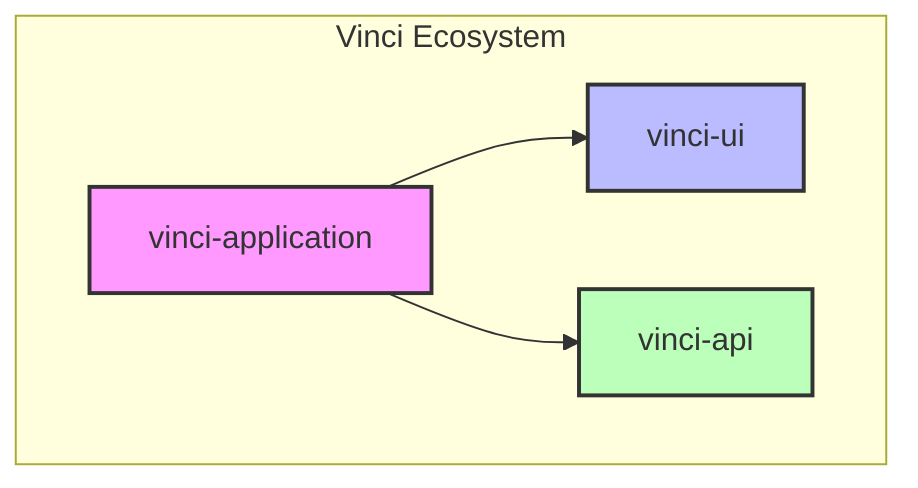

# Vinci Application Architecture

This document outlines the architectural structure of the Vinci ecosystem, consisting of three main projects: vinci-application (desktop/web client), vinci-api (backend API), and vinci-ui (shared UI components).

## Project Overview



## 1. vinci-application (Desktop/Web Client)

```
src/
├── core/                  # Core client functionality
│   ├── auth/             # Auth state and logic
│   ├── state/            # Global state management
│   └── cache/            # Client-side caching
├── features/             # Feature-based modules
│   ├── command-center/   # Command center functionality
│   │   ├── components/   # Feature-specific components
│   │   ├── hooks/       # Feature-specific hooks
│   │   ├── providers/   # Feature-specific providers
│   │   └── types/       # Feature-specific types
│   ├── chat/            # Chat functionality
│   ├── spaces/          # Spaces management
│   └── conversations/   # Conversation management
├── shared/              # App-specific shared resources
│   ├── components/      # App-specific components
│   ├── hooks/          # App-specific hooks
│   ├── utils/          # App-specific utilities
│   ├── types/          # App-specific types
│   ├── styles/         # App-specific styles
│   └── config/         # App configuration
├── pages/              # Next.js pages
│   └── app/           # App pages
└── electron/          # Electron-specific code
    ├── main/         # Main process
    ├── preload/      # Preload scripts
    └── types/        # Electron-specific types
```

### Key Features
- Desktop application wrapper (Electron)
- Web application (Next.js)
- Command center interface
- Chat functionality
- Spaces management
- Conversation management

## 2. vinci-api (Next.js API)

### Directory Structure
```
app/
├── api/                               # API routes
│   ├── spaces/                        # Spaces resource
│   │   ├── route.ts                   # GET (list), POST (create)
│   │   └── [id]/
│   │       ├── route.ts               # GET, PUT, DELETE
│   │       └── conversations/         # Nested conversations resource
│   │           └── route.ts           # GET (list), POST (create)
│   ├── conversations/                 # Conversations resource
│   │   ├── route.ts                   # GET (list)
│   │   └── [id]/
│   │       ├── route.ts               # GET, PUT, DELETE
│   │       └── messages/             # Nested messages resource
│   │           └── route.ts           # GET (list), POST (create)
│   ├── messages/                      # Messages resource
│   │   ├── route.ts                   # GET (list)
│   │   └── [id]/
│   │       └── route.ts               # GET, PUT, DELETE
│   ├── models/                        # Models resource
│   │   ├── route.ts                   # GET (list)
│   │   └── [id]/
│   │       └── route.ts               # GET
│   └── auth/                         # Auth endpoints
│       ├── login/
│       │   └── route.ts               # POST
│       ├── logout/
│       │   └── route.ts               # POST
│       └── refresh/
│           └── route.ts               # POST
lib/
├── core/                # Core functionality
│   ├── database/       # Database (Supabase) interactions
│   ├── ai/            # AI providers
│   └── cache/         # Caching logic
├── services/          # Business logic services
└── utils/             # Utility functions
```

### RESTful API Endpoints

#### Spaces Resource
```typescript
// GET /api/spaces
Response {
  data: Space[]
  metadata: {
    total: number
    page: number
    limit: number
  }
}

// POST /api/spaces
Request {
  name: string
  description?: string
  settings?: SpaceSettings
}
Response {
  data: Space
}

// GET /api/spaces/:id
Response {
  data: Space
}

// PUT /api/spaces/:id
Request {
  name?: string
  description?: string
  settings?: SpaceSettings
}
Response {
  data: Space
}

// DELETE /api/spaces/:id
Response {
  success: boolean
}
```

#### Conversations Resource
```typescript
// GET /api/spaces/:spaceId/conversations
Response {
  data: Conversation[]
  metadata: {
    total: number
    page: number
    limit: number
  }
}

// POST /api/spaces/:spaceId/conversations
Request {
  title?: string
  model: string
  provider: string
}
Response {
  data: Conversation
}
```

#### Messages Resource
```typescript
// GET /api/conversations/:conversationId/messages
Response {
  data: Message[]
  metadata: {
    total: number
    page: number
    limit: number
  }
}

// POST /api/conversations/:conversationId/messages
Request {
  content: string
  role: 'user' | 'assistant'
  model?: string
  provider?: string
}
Response {
  data: Message
}
```

### Standard Response Format
```typescript
// Success Response
{
  status: 'success',
  data: T,                // Generic type for response data
  metadata?: {            // Optional metadata for pagination
    total: number,
    page: number,
    limit: number
  }
}

// Error Response
{
  status: 'error',
  error: {
    code: string,        // Error code
    message: string,     // User-friendly message
    details?: any       // Additional error details
  }
}
```

### HTTP Status Codes
- 200: Successful GET, PUT
- 201: Successful POST
- 204: Successful DELETE
- 400: Bad Request
- 401: Unauthorized
- 403: Forbidden
- 404: Not Found
- 422: Unprocessable Entity
- 500: Internal Server Error

## 3. vinci-ui (Shared UI Components)

```
src/
├── components/       # Generic UI components
│   ├── input/       # Input components
│   ├── select/      # Select components
│   ├── button/      # Button components
│   └── ...         # Other UI components
├── styles/          # Base styles and themes
└── types/          # Component types
```

### Key Features
- Generic, reusable UI components
- Base styles and themes
- TypeScript types for components

## Implementation Guidelines

### 1. Code Organization
- Feature-based organization in vinci-application
- RESTful resource-based organization in vinci-api
- Component-based organization in vinci-ui

### 2. State Management
- Global state in core/state
- Feature-specific state in respective feature modules
- Clear separation between client and server state

### 3. API Integration
- RESTful API endpoints
- Consistent response formats
- Proper error handling
- Authentication/Authorization

### 4. Component Usage
- Use vinci-ui for generic components
- Create app-specific components in shared/components
- Feature-specific components in respective feature modules

### 5. Type Safety
- Strict TypeScript usage
- Shared types between projects where appropriate
- Clear type definitions for API requests/responses