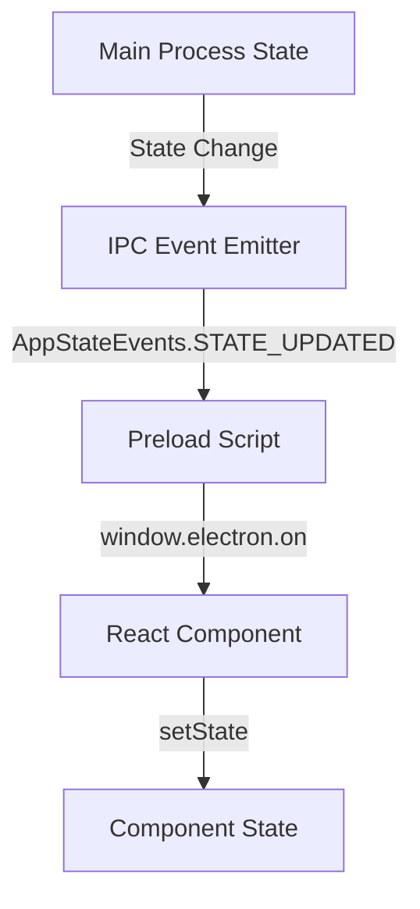
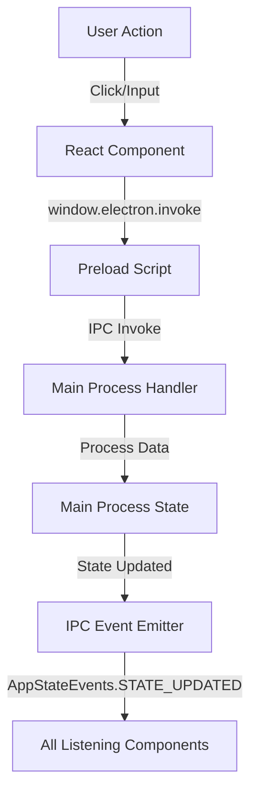

# Component Data Flow Guide

## Overview

This guide explains how React components in our Electron application should handle data flow between the renderer process (React components) and the main process (Electron backend) using our centralized IPC event system and state management.

## Data Flow Architecture

### 1. Main Process → Renderer Process Flow


Using our centralized IPC events from `src/core/ipc/constants.ts`:



#### Example Implementation
```typescript
// In your React component
import { useEffect, useState } from 'react';
import { User } from '@/src/types';
import { AppStateEvents } from '@/src/core/ipc/constants';

export function UserProfile() {
  const [user, setUser] = useState<User | null>(null);

  useEffect(() => {
    // 1. Set up listener for state updates
    const cleanup = window.electron.on('state-updated', (event, response) => {
      if (response.success && response.data.user) {
        setUser(response.data.user);
      }
    });

    // 2. Request initial state
    window.electron.invoke(AppStateEvents.GET_STATE)
      .then((response) => {
        if (response.success && response.data.user) {
          setUser(response.data.user);
        }
      });

    // 3. Clean up listener on unmount
    return cleanup;
  }, []);

  if (!user) return <div>Loading...</div>;

  return (
    <div>
      <h1>{user.name}</h1>
      {/* ... */}
    </div>
  );
}
```

### 2. Renderer Process → Main Process Flow



#### Example Implementation
```typescript
// In your React component
import { useState } from 'react';

export function UpdateProfile() {
  const [isUpdating, setIsUpdating] = useState(false);

  const handleUpdateProfile = async (newData: any) => {
    try {
      setIsUpdating(true);
      
      // 1. Send update request to main process
      const response = await window.electron.invoke('update-profile', newData);
      
      if (!response.success) {
        throw new Error(response.error);
      }

      // 2. Main process will emit state update
      // 3. Components listening for state updates will receive new data
      
    } catch (error) {
      console.error('Failed to update profile:', error);
    } finally {
      setIsUpdating(false);
    }
  };

  return (
    <button 
      onClick={() => handleUpdateProfile({ name: 'New Name' })}
      disabled={isUpdating}
    >
      {isUpdating ? 'Updating...' : 'Update Profile'}
    </button>
  );
}
```

## Best Practices

### 1. Component Setup

```typescript
import { AppStateEvents, AuthEvents, SpaceEvents, MessageEvents } from '@/src/core/ipc/constants';
import { IpcEventType } from '@/src/types';

// Custom hook for handling IPC communication
function useIpcState<T>(eventType: IpcEventType, initialValue: T) {
  const [state, setState] = useState<T>(initialValue);

  useEffect(() => {
    // Set up listener
    const cleanup = window.electron.on(eventType, (event, response) => {
      if (response.success) {
        setState(response.data);
      }
    });

    // Get initial state
    window.electron.invoke(eventType)
      .then((response) => {
        if (response.success) {
          setState(response.data);
        }
      });

    return cleanup;
  }, [eventType]);

  return state;
}

// Using the hook in a component
function ConversationList() {
  const conversations = useIpcState(MessageEvents.GET_CONVERSATION_MESSAGES, []);
  
  return (
    <div>
      {conversations.map(conversation => (
        <ConversationItem key={conversation.id} {...conversation} />
      ))}
    </div>
  );
}
```

### 2. Error Handling

```typescript
function useIpcAction(actionType: IpcEventType) {
  const [isLoading, setIsLoading] = useState(false);
  const [error, setError] = useState<string | null>(null);

  const execute = async (...args: any[]) => {
    try {
      setIsLoading(true);
      setError(null);

      const response = await window.electron.invoke(actionType, ...args);
      
      if (!response.success) {
        throw new Error(response.error);
      }

      return response.data;
    } catch (err) {
      setError(err.message);
      throw err;
    } finally {
      setIsLoading(false);
    }
  };

  return { execute, isLoading, error };
}

// Using the hook
function MessageSender() {
  const { execute, isLoading, error } = useIpcAction(MessageEvents.SEND_MESSAGE);

  const handleSend = async (message: string) => {
    try {
      await execute({ content: message });
      // Success! Main process will emit state update
    } catch (err) {
      // Handle error (already set in hook)
    }
  };

  return (
    <div>
      {error && <div className="error">{error}</div>}
      <button disabled={isLoading}>
        {isLoading ? 'Sending...' : 'Send'}
      </button>
    </div>
  );
}
```

### 3. State Synchronization

```typescript
// Custom hook for synced state
function useSyncedState<T>(eventType: IpcEventType, initialState: T) {
  const [state, setState] = useState<T>(initialState);

  useEffect(() => {
    // Listen for state updates
    const cleanup = window.electron.on(eventType, (event, response) => {
      if (response.success) {
        setState(response.data);
      }
    });

    // Get initial state
    window.electron.invoke(eventType)
      .then((response) => {
        if (response.success) {
          setState(response.data);
        }
      });

    return cleanup;
  }, [eventType]);

  // Function to update state
  const updateState = async (newState: T) => {
    const response = await window.electron.invoke(eventType, newState);
    return response.success;
  };

  return [state, updateState] as const;
}

// Using synced state
function UserSettings() {
  const [settings, updateSettings] = useSyncedState(AppStateEvents.GET_STATE, {});

  const handleThemeChange = async (theme: string) => {
    await updateSettings({ ...settings, theme });
  };

  return (
    <div>
      <select 
        value={settings.theme} 
        onChange={e => handleThemeChange(e.target.value)}
      >
        <option value="light">Light</option>
        <option value="dark">Dark</option>
      </select>
    </div>
  );
}
```

## Common Patterns

### 1. Loading States

- Always show loading states during IPC communication
- Handle initial data loading
- Provide feedback during updates

### 2. Error Handling
- Handle both network and IPC errors
- Show user-friendly error messages
- Provide retry mechanisms

### 3. State Updates

- Listen for global state changes
- Update local state accordingly
- Handle race conditions

### 4. Cleanup

- Always remove IPC listeners on component unmount
- Cancel pending operations when appropriate
- Clear local state when needed

## Anti-Patterns to Avoid

1. **Direct Store Access**

❌ Don't try to access the main process store directly
✅ Use IPC communication for all data access

2. **Multiple Listeners**
❌ Don't set up multiple listeners for the same event
✅ Use a single listener and share state through props or context

3. **Missing Error Handling**
❌ Don't assume IPC calls will always succeed
✅ Always handle potential errors

4. **Skipping Cleanup**
❌ Don't forget to remove listeners on unmount
✅ Always return cleanup function in useEffect

## Performance Considerations

1. **Debouncing/Throttling**

```typescript
function useDebounceIpc(delay: number) {
  const timeoutRef = useRef<NodeJS.Timeout>();

  const debounce = (fn: () => void) => {
    if (timeoutRef.current) {
      clearTimeout(timeoutRef.current);
    }
    timeoutRef.current = setTimeout(fn, delay);
  };

  useEffect(() => {
    return () => {
      if (timeoutRef.current) {
        clearTimeout(timeoutRef.current);
      }
    };
  }, []);

  return debounce;
}
```

2. **Selective Updates**
```typescript
function useSelectiveSync<T>(selector: (data: any) => T) {
  const [state, setState] = useState<T | null>(null);
  const prevValue = useRef<T | null>(null);

  useEffect(() => {
    const cleanup = window.electron.on('state-updated', (event, response) => {
      if (response.success) {
        const newValue = selector(response.data);
        if (JSON.stringify(newValue) !== JSON.stringify(prevValue.current)) {
          prevValue.current = newValue;
          setState(newValue);
        }
      }
    });

    return cleanup;
  }, [selector]);

  return state;
}
```

## Testing Components

```typescript
// Example test for a component using IPC
import { render, fireEvent, waitFor } from '@testing-library/react';
import { UserProfile } from './UserProfile';

// Mock window.electron
const mockElectron = {
  on: jest.fn(),
  invoke: jest.fn(),
  off: jest.fn(),
};

window.electron = mockElectron;

describe('UserProfile', () => {
  beforeEach(() => {
    jest.clearAllMocks();
  });

  it('should load and display user data', async () => {
    // Mock successful response
    mockElectron.invoke.mockResolvedValueOnce({
      success: true,
      data: { name: 'Test User' }
    });

    const { getByText } = render(<UserProfile />);

    // Should show loading initially
    expect(getByText('Loading...')).toBeInTheDocument();

    // Should show user data after loading
    await waitFor(() => {
      expect(getByText('Test User')).toBeInTheDocument();
    });
  });
});
```
