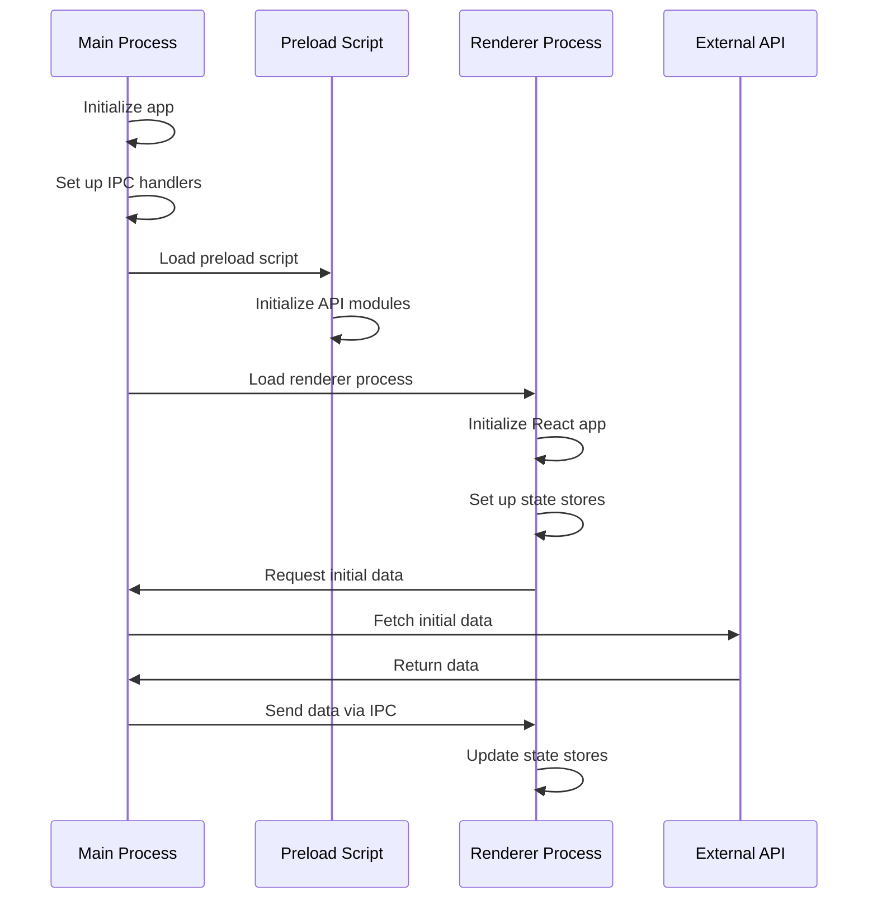
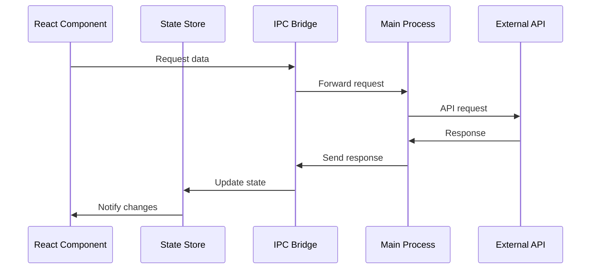

# Data Flow Architecture

## Overview

This document outlines the complete data flow architecture of our Electron application, from startup to API interactions and state updates.

## Application Startup Flow



## Core Components

### 1. Main Process (`main.ts`)

- Entry point of the application
- Event Constants (`src/core/ipc/constants.ts`):
  ```typescript
  // Authentication events
  export const AuthEvents = {
    GET_SESSION: 'get-session',
    GET_AUTH_TOKEN: 'get-auth-token',
    SIGN_UP: 'sign-up',
    SIGN_OUT: 'sign-out'
  };

  // Command center events
  export const CommandCenterEvents = {
    OPEN_DIALOG: 'open-dialog',
    DIALOG_OPENED: 'dialog-opened',
    DIALOG_CLOSED: 'dialog-closed'
  };

  // Space events
  export const SpaceEvents = {
    GET_SPACES: 'get-spaces',
    CREATE_SPACE: 'create-space',
    UPDATE_SPACE: 'update-space'
  };
  ```

- Entry point of the application
- Responsibilities:
  - Window management
  - IPC handler setup
  - System API interactions
  - External API communication
  - File system operations

### 2. Preload Script (`preload.ts`)

- Bridge between main and renderer processes
- Modules:
  - Authentication API
  - Command Center API
  - App State API
  - Space Management API
  - Message Handling API
  - IPC Utilities

### 3. Renderer Process (React Application)

- User interface and state management
- Components:
  - State stores
  - React components
  - Custom hooks for IPC
  - Event handlers

## Data Flow Patterns

### 1. API Data Fetching



### 2. State Updates

1. **Local State Updates with Custom Hooks**
   ```typescript
   // Custom hook for IPC communication
   const useIpcEffect = (channel: string, callback: (data: any) => void) => {
     useEffect(() => {
       ipcRenderer.on(channel, (_, data) => callback(data));
       return () => {
         ipcRenderer.removeListener(channel, callback);
       };
     }, [channel, callback]);
   };

   // Usage in component
   const MyComponent = () => {
     const [data, setData] = useState<Data>();
     
     useIpcEffect(SpaceEvents.GET_SPACES, (spaces) => {
       setData(spaces);
     });
   };
   ```
   ```typescript
   // Component level
   const [localState, setLocalState] = useState<Data>();
   
   // Update through IPC
   useEffect(() => {
     ipcRenderer.on('data-update', (event, data) => {
       setLocalState(data);
     });
   }, []);
   ```

2. **Global State Updates with State Management**
   ```typescript
   // Store definition
   interface AppState {
     spaces: Space[];
     messages: Message[];
     loading: boolean;
     setSpaces: (spaces: Space[]) => void;
     setMessages: (messages: Message[]) => void;
   }

   const useStore = create<AppState>((set) => ({
     spaces: [],
     messages: [],
     loading: false,
     setSpaces: (spaces) => set({ spaces }),
     setMessages: (messages) => set({ messages })
   }));

   // IPC listener setup
   ipcRenderer.on(SpaceEvents.GET_SPACES, (_, spaces) => {
     useStore.getState().setSpaces(spaces);
   });
   ```
   ```typescript
   // Store level
   const useStore = create<AppState>((set) => ({
     data: null,
     setData: (data) => set({ data }),
   }));
   
   // Update through IPC
   ipcRenderer.on('global-update', (event, data) => {
     useStore.getState().setData(data);
   });
   ```

## State Synchronization

### 1. Main Process → Renderer

```typescript
// Main process handler
ipcMain.handle(SpaceEvents.GET_SPACES, async () => {
  try {
    const spaces = await api.getSpaces();
    // Broadcast to all windows
    BrowserWindow.getAllWindows().forEach((window) => {
      window.webContents.send(SpaceEvents.GET_SPACES, spaces);
    });
    return spaces;
  } catch (error) {
    console.error('Failed to fetch spaces:', error);
    throw error;
  }
});

// Renderer process listener
const { spaces } = useStore();
useIpcEffect(SpaceEvents.GET_SPACES, (newSpaces) => {
  useStore.getState().setSpaces(newSpaces);
});

- IPC events trigger state updates
- State changes propagate through stores
- Components react to store updates

### 2. Renderer → Main Process

- User actions trigger IPC events
- Main process handles requests
- Results flow back to renderer

## Error Handling

1. **API Errors**
   ```typescript
   try {
     const response = await api.getData();
     sendToRenderer('data-success', response);
   } catch (error) {
     sendToRenderer('data-error', error);
     logError(error);
   }
   ```

2. **IPC Errors**
   ```typescript
   ipcMain.handle('request-data', async (event, args) => {
     try {
       return await processRequest(args);
     } catch (error) {
       return { error: error.message };
     }
   });
   ```

## Performance Considerations

1. **Data Caching**
   - Cache API responses
   - Implement local storage
   - Use memory cache for frequent data

2. **State Updates**
   - Batch updates when possible
   - Debounce frequent changes
   - Use selective updates

3. **IPC Communication**
   - Minimize payload size
   - Use typed events
   - Implement request queuing

## Best Practices

1. **Data Fetching**
   - Use centralized API clients
   - Implement retry mechanisms
   - Handle offline scenarios

2. **State Management**
   - Follow single source of truth
   - Use atomic updates
   - Implement proper cleanup

3. **Error Handling**
   - Consistent error formats
   - Proper error propagation
   - User-friendly error messages

## Monitoring and Debugging

1. **IPC Monitoring**
   - Log IPC events
   - Track payload sizes
   - Monitor event frequency

2. **State Tracking**
   - Debug state changes
   - Track update sources
   - Monitor performance

3. **Error Tracking**
   - Log error details
   - Track error patterns
   - Monitor API health
